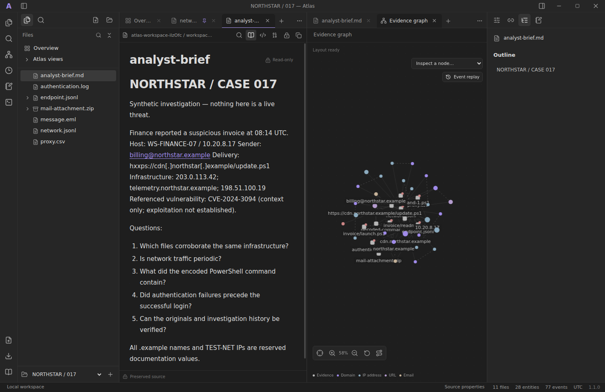

# Atlas

**Atlas 1.1.0 — a local evidence workbench with an Obsidian-style desktop workspace.**

Atlas preserves original bytes, extracts indicators, reconstructs event timelines and builds an interactive provenance graph. No cloud service, account, API key or runtime installation required in packaged builds. Windows and Linux, MIT.



## Use

Download the Windows installer or portable ZIP from [Atlas 1.1.0](https://github.com/atlasru/unknown/releases/tag/v1.1.0). Linux builds include AppImage and a portable tar.gz. The first launch opens **NORTHSTAR / 017**, a complete synthetic investigation with reserved `.example` infrastructure and TEST-NET addresses.

1. Open **Evidence graph**, select `cdn.northstar.example`, then follow a source mention.
2. Search **Evidence vault** for `name:decoded` to inspect the decoded PowerShell command.
3. Compare network activity with the authentication burst in **Event timeline**.
4. Review the explainable findings and append observations in **Analyst notebook**.
5. Verify original bytes and the history chain, then export an independent evidence bundle.

Create a new investigation for your own files. Import multiple files, a folder, or drag sources into Atlas. Imported programs are never executed and extracted infrastructure is never contacted.

## Workspace

Browse a hierarchical file tree, open a temporary preview or pinned tab, drag tabs into nested splits, and collapse either sidebar. **Ctrl+O** opens a file; **Ctrl+P** runs any command; **Ctrl+Backslash** splits right; **Ctrl+Shift+Backslash** splits down. Properties, observed connections, outline and source observations follow the active pane. All original investigation tools remain available as tabs. Overview is a compact case briefing.

Import an Obsidian folder with the existing importer. Read Markdown with frontmatter, wikilinks/aliases, relative and heading links, GFM tables/tasks, and imported attachments. Original bytes, hashes, versions and provenance are preserved. Source and hex inspection remain one click away. See the [workspace guide and full feature mapping](docs/WORKSPACE.md).

The analysis engine and sandbox preload are byte-for-byte unchanged from Atlas 1.0. Application identity, database schema and existing case data remain compatible.

## Capabilities

- **Content-addressed evidence vault:** SHA-256 originals, SHA-1/MD5 metadata, immutable copies, repeated-import deduplication and changed-source versions.
- **Static analysis:** text, logs, JSONL, CSV, EML, PDF, binary ASCII/UTF-16 strings, PE headers/sections, nested ZIP members and encoded PowerShell commands.
- **Entity normalization:** defanged IPv4, domains, URLs, emails, CVEs and hashes; source line, excerpt and character offset for each occurrence.
- **Provenance graph:** observed DNS resolutions, URL hosts, email domains, file mentions and archive/decoding lineage. Barnes–Hut layout in a Web Worker, node dragging, pan/zoom, inspection and shortest-path tracing across the full stored graph.
- **Event replay:** animate the graph from source timestamps without restarting the layout. Untimed context remains visible; replay does not invent event timestamps.
- **Timeline:** ISO 8601 detection, UTC normalization, ordered events, date/content/type filters, one-click source inspection.
- **Explainable signals:** encoded commands, download/execute patterns, credential/persistence/evasion references, disguised MZ/PE files, writable executable sections and low-variance periodic network activity.
- **FTS5 queries:** text/phrase search plus `ext:`, `risk:`, `has:`, `name:` and `sha256:` filters.
- **Analyst workflow:** multiple isolated cases, evidence-bound notes, review/dismiss/reopen decisions, command palette and keyboard navigation.
- **Independent exports:** original bytes, full `case.json` and escaped `report.html` inside a ZIP; standard-library verifier included.
- **Desktop lifecycle:** single instance, private bundled Python engine, authenticated loopback API, sandboxed renderer, constrained IPC, local-only resource loading and graceful engine shutdown.

## Shortcuts

| Shortcut | Action |
|---|---|
| Ctrl+K | Command palette |
| Ctrl+O | Import files |
| Ctrl+Shift+O | Import folder |
| Ctrl+1…8 | Investigation pages |
| Esc | Close inspector or modal |

## Development

Node.js 24, Python 3.12. On Linux, Electron requires standard GTK/NSS/audio libraries and a graphical session. CI uses Ubuntu 24.04 and Windows.

```bash
npm ci
python -m pip install -r requirements-dev.txt
python scripts/create_icon.py
npm run dev
```

```bash
python -m pytest -q
npm run test:ui
npm run format:check
npm run build
# Linux CI / a machine without a desktop:
xvfb-run -a npm run test:e2e
# Windows or a running Linux desktop:
npm run test:e2e
python scripts/build_engine.py
npx electron-builder --publish never
```

If Python is not `python3` on Linux or `python` on Windows, set `ATLAS_PYTHON` to its executable path. Packaged builds do not need Python installed. `ATLAS_DATA_DIR` selects a different local workspace; otherwise Electron's OS application-data folder is used.

Verify an exported bundle without installing Atlas:

```bash
python scripts/verify_bundle.py Atlas-case.zip
```

## Boundaries

Atlas provides static, heuristic analysis. A reference to a tool, a CVE or a suspicious command is not a malware verdict. Graph paths establish observed relationships and co-occurrence, not causation. Binary-string and PDF offsets refer to derived text, not raw-file byte offsets. Timestamps without a timezone are interpreted as UTC.

Each import analyzes up to 3,000 files and 512 MiB of cumulative source/derived bytes. Individual files are capped at 64 MiB. ZIP traversal depth is 3, with 2,000 entries per archive and expansion-ratio checks. PDFs run in a separate, time-limited process: 200 pages, 25 seconds. Preserved text is capped at 4,000,000 characters per file. Skipped members and parser failures remain visible; original bytes are retained for parser failures.

The graph display caps the view at 1,000 files and 1,500 entities; search, timeline pagination, exports and path tracing use stored data. Integrity checks cover original bytes, evidence metadata and the audit hash chain. They are local checks, not an external digital signature or independent timestamp. A party with full write access can rebuild a local chain. Derived text and analyst decisions remain reviewable data.

See [architecture](docs/ARCHITECTURE.md) for implementation details.

See [validation](docs/VALIDATION.md) for measured performance and test coverage.
